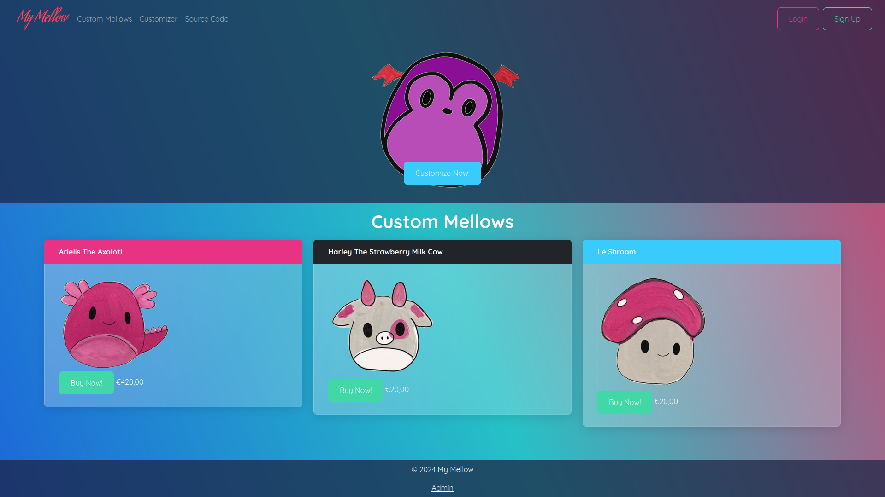
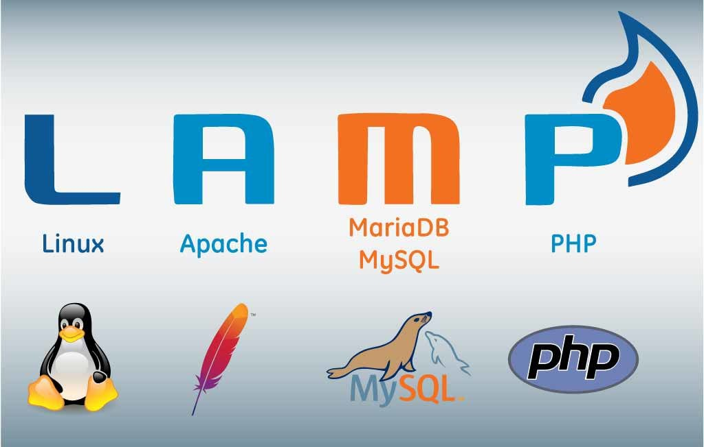
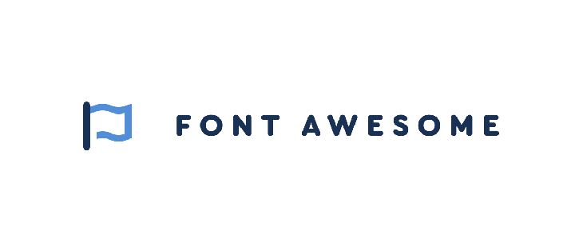

# TOC
[About](#about)\
[License](#license)\
[The Stack](#the-stack)\
[Installation](#installation)

# About
My Mellow is a website where you can customize your own squishmellow.\
This website is entirely designed and developed by me, Mehdi El Khallouki.\
It was made as a full-stack project for my study at the Bit Academy.\
You can also find the website <a href="http://mymellow.mooo.com">here</a>\
I hope you like it! Feel free to message me if you have any questions about the website.



# License
For this website I made use of the GNU Affero GPL V3.\
You can read all of its details in the <a href="LICENSE">LICENSE</a> file

# The Stack
The stack used for this project were the infamous LAMP (Linux, Apache, MySQL, PHP) stack along with Bootstrap (Powered by Bootswatch), Fontawesome for the icons and Quicksand as the font.\
Here are some logos you might like ofcourse.\





# Installation
In order to host this website for yourself I recommend using Linux as your host.\
In theory it should work on Windows but it is not tested there.\
Install and setup a proper LAMP environment using Apache, PHP and MariaDB.\
There are multiple ways you can install this program as shown here:
- [Source](#build-from-src)
- [Dist](#download-the-dist)

## Build from src
Install Node Package Manager and cd to the project root.\
Run the following command to build all the styling and scripts: ```npm run build```.\
Copy all the contents of the site/ folder into the root of your Apache host.

## Download the dist
You can also download the distribution directly from [this page](https://github.com/MTech-cmd/SquishFactory/releases/tag/V1) on GitHub.\
Copy all the contents of the folder into the root of your Apache host.

## Database
Run the script found in db/import.sql in your MySQL console.\
Insert the right db credentials in site/connector.php\
You're ready!

## Mock data
I have preloaded some mock assets and data. you can find the assets in the site/assets/ folder.\
In order to utilise the assets you must run the script in db/mock.sql the same way you run the import.sql. The website runs fine without it but then you must initialise the admin user manually using the CLI tool found in site/admin/add.php.