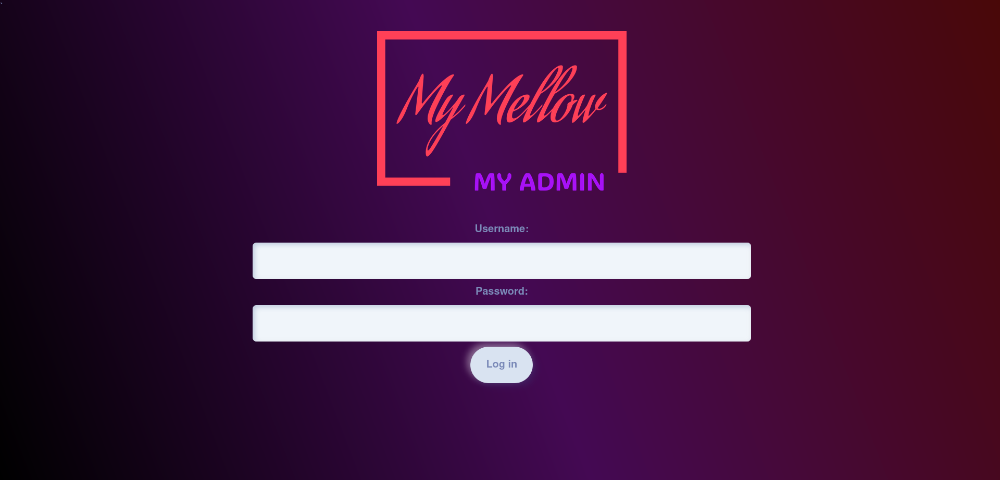
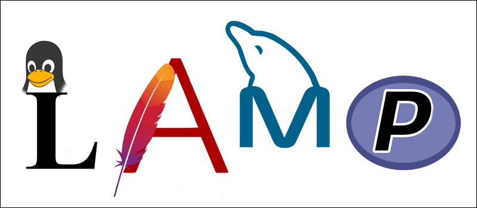

# About
This is a website where you can manage your own web shop.\
This site is fully developed by me, Mehdi El Khallouki.\
I developed this website as an end-years project for my study at the Bit Academy as a full-stack developer.



# TOC
[Features](#features)\
[The Stack](#the-stack)\
[Installation](#installation)\
[Usage](#usage)
# Features
There are many features to this website but the main ones are customizing and ordering squishmellows. Customizing them. Adding new ones. and much more\

# The Stack
Naturally I use the popular LAMP (Linux, Apache, MariaDB, PHP) stack.\
In addition I used a few other tools like Bootstrap (powered by Bootswatch) Fontawesome and Quicksand


# Installation
To host this on your own server configure a proper LAMP stack and clone the repo.\
Cd into the repo and run the following command:
```Bash
npm run build
```
After that deploy all the contents of the /site directory into the root of your server folder.\
Then run the /db/import.sql script into your MySQL console (This may be the CLI, PHPMyAdmin or DataGrip).

# Usage
In order to use this application you first must initialize a new administrator. Do this with the CLI-tool located at src/admin/add.php.\
Run the tool with php.\
Serve the website or visit it [here](mymellow.mooo.com).